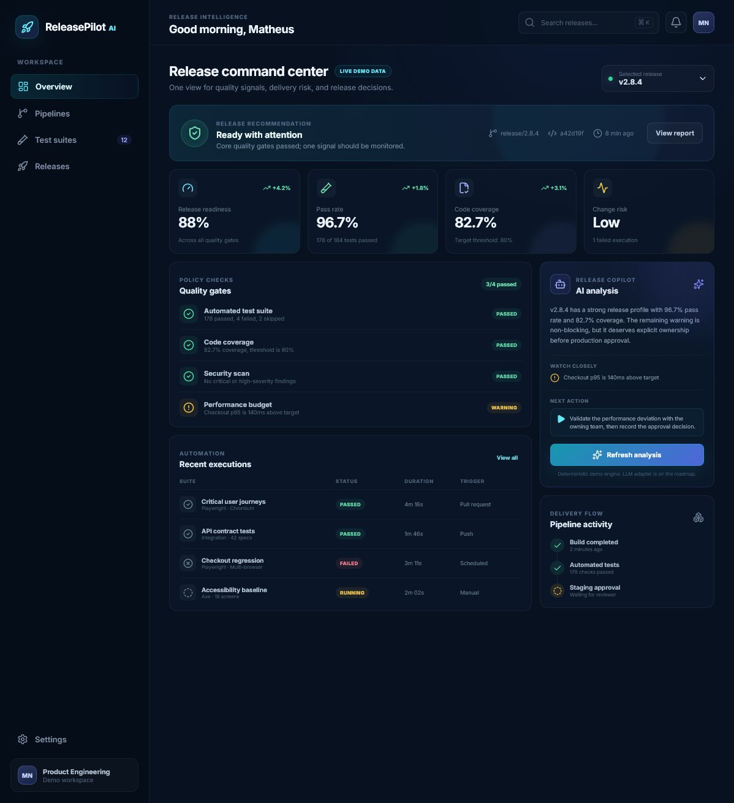

<div align="center">

# ReleasePilot AI

**Release intelligence for teams that need evidence, not guesswork.**

[](https://github.com/mnnobre/releasepilot-ai/actions/workflows/ci.yml)
[](https://react.dev/)
[](https://www.typescriptlang.org/)
[](LICENSE)

[Live demo](https://mnnobre.github.io/releasepilot-ai/) ·
[Architecture](docs/ARCHITECTURE.md) ·
[Roadmap](docs/ROADMAP.md)

</div>

ReleasePilot AI is a portfolio product that consolidates test evidence, quality
gates, delivery risk, and release recommendations in one command center.

This first public milestone is a functional frontend product slice. It uses
typed demo data and a deterministic analysis engine, so the experience is
fully testable and does not pretend to have a production AI integration.



## Product preview

The dashboard includes:

- release readiness, pass rate, coverage, and change risk;
- quality gates with explicit pass, warning, and failure states;
- recent automated test executions;
- release switching and a detailed decision report;
- a local analysis engine behind a future AI adapter contract;
- responsive desktop and mobile layouts.

## Why this project

Release decisions often live across CI logs, test reports, spreadsheets, and
chat messages. ReleasePilot explores a clearer workflow:

```text
collect evidence -> evaluate policies -> explain risk -> approve release
```

It connects areas I work with and study: enterprise application development,
API integrations, test automation, delivery workflows, and AI-driven software
engineering.

## Tech stack

- React 19 and TypeScript
- Vite
- Vitest and Testing Library
- Lucide icons
- GitHub Actions
- CSS with responsive design and accessible interactions

## Run locally

```bash
git clone https://github.com/mnnobre/releasepilot-ai.git
cd releasepilot-ai
npm install
npm run dev
```

Quality checks:

```bash
npm run lint
npm test
npm run build
```

## Engineering notes

- The current analysis is deterministic and covered by unit tests.
- Every number shown in the UI comes from clearly identified demo fixtures.
- Policy enforcement should remain deterministic when an LLM adapter is added.
- Future AI summaries must cite evidence and remain reviewable by a person.

Read the [architecture](docs/ARCHITECTURE.md) and
[roadmap](docs/ROADMAP.md) for the technical direction.

## Current status

`v0.1.0` demonstrates the product workflow and visual system. The next
milestone introduces real evidence ingestion through an API and PostgreSQL.

---

Built by [Matheus Nobre](https://github.com/mnnobre) as a practical study in
quality engineering, automation, and AI-assisted delivery.
